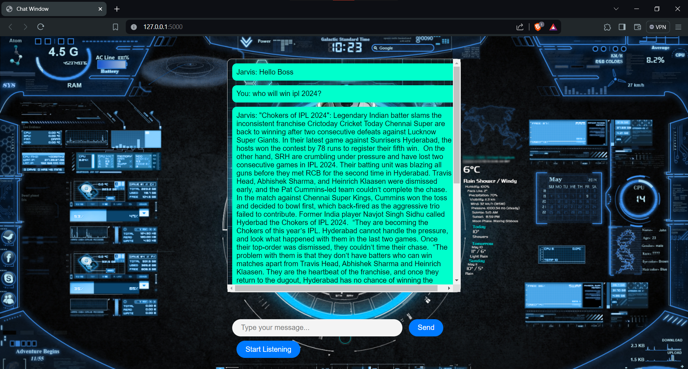
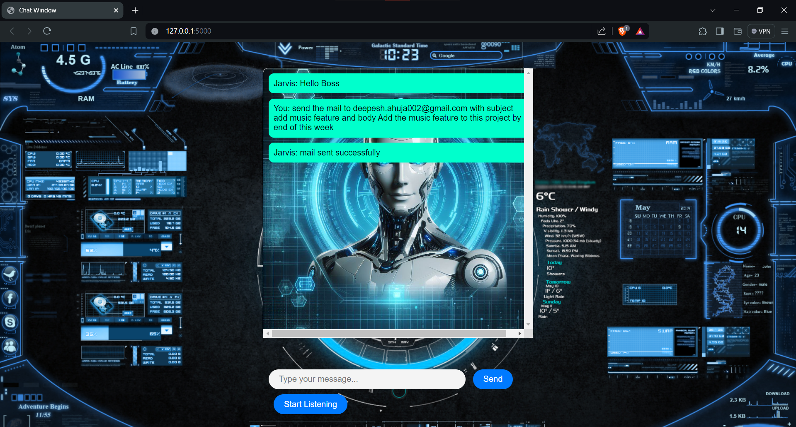

# Jarvis AI assistant using Gemini AI

Jarvis AI is a simple AI assistant to do task like sending emails, playing music, telling you the weather, news, etc.

It is a simple AI assistant to do task like sending emails, playing music, telling you the weather, news, etc.

## Features

- Searches on Gemini AI
- Tell Weather
- Tell ip address
- Google Search (under working)
- Send Emails
- Tell News

## Prerequisites

Get your Gemini API key from here [makersuite](https://makersuite.google.com/app/apikey) and add it in config.py

Get your Weather API key from here [Weather RapidApi](https://rapidapi.com/apishub/api/yahoo-weather5/) select python(requests) in the code snippets and then subscribe to the free account and then add it in config.py

Get your Mail API key from here [Mail RapidApi](https://rapidapi.com/sujoyk211/api/mail-sender-api1/) select python(requests) in the code snippets and then subscribe to the free account and then add it in config.py

Get your News API key from here [News RapidApi](https://rapidapi.com/letscrape-6bRBa3QguO5/api/real-time-news-data/) select python(requests) in the code snippets and then subscribe to the free account and then add it in config.py

## Create virtual environment

`pip install virtualenv`

`virtualenv jarvis`

`source jarvis/bin/activate`

`cd jarvis`

## Installation

`git clone https://github.com/DeepeshAhuja/Jarvis_using_Gemini_AI`

`cd Jarvis_using_Gemini_AI`

`pip install -r requirements.txt`

## Run

`python flask1.py`

open the browser and go to `http://localhost:5000/`

## Error Handling

If you have ffmpeg error then you can install ffmpeg in your linux system by `sudo apt install ffmpeg` and for windows follow this page [GeeksForGeeks](https://www.geeksforgeeks.org/how-to-install-ffmpeg-on-windows/)

## Screenshot

# Weather

# Ip Address

# News

# Email
